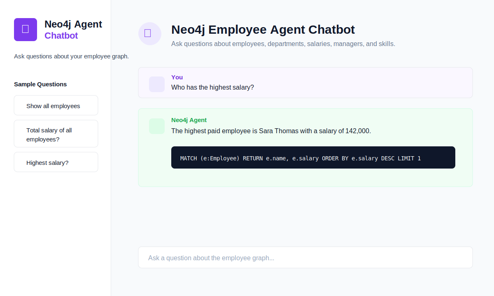

# Neo4j Employee Agent Chatbot

A sample Streamlit application that lets users ask natural language questions about an employee graph stored in Neo4j. It is designed as a Neo4j version of an SQL employee chatbot demo: the app shows the answer, the Cypher query that ran, and optional result records.



## Features

- Streamlit chat UI inspired by the reference SQL agent screenshot
- Neo4j employee graph with `Employee`, `Department`, and `Skill` nodes
- Relationships for `WORKS_IN`, `REPORTS_TO`, `HAS_SKILL`, and `COLLABORATES_WITH`
- Sample question buttons for common employee analytics
- Cypher query display for learning and debugging
- Seed data from the app or from `neo4j/seed.cypher`

## Project Structure

```text
.
├── app/
│   ├── agent.py        # Natural-language intent mapping to Cypher
│   ├── graph.py        # Neo4j connection and seed logic
│   └── main.py         # Streamlit UI
├── neo4j/
│   └── seed.cypher     # Standalone seed script
├── docker-compose.yml  # Local Neo4j database
├── requirements.txt
└── README.md
```

## Quick Start

### 1. Start Neo4j

```bash
docker compose up -d
```

Neo4j Browser will be available at <http://localhost:7474>.

Default credentials:

```text
Username: neo4j
Password: password123
```

### 2. Create and activate a virtual environment

```bash
python3 -m venv .venv
source .venv/bin/activate
pip install -r requirements.txt
```

### 3. Run the app

```bash
streamlit run app/main.py
```

Open the Streamlit URL, then click **Seed Demo Data** in the sidebar once.

## Example Questions

- Show all employees
- What is the total salary of all employees?
- Who has the highest salary?
- List all employees in Engineering department
- Show reporting relationships
- Who has skill Neo4j?
- What is the average salary?

## Environment Variables

Copy `.env.example` to `.env` if you want to customize connection settings:

```bash
cp .env.example .env
```

The app reads:

```text
NEO4J_URI
NEO4J_USERNAME
NEO4J_PASSWORD
NEO4J_DATABASE
```

## GitHub Upload

From this directory:

```bash
git init
git add .
git commit -m "Add Neo4j employee agent chatbot sample"
gh repo create neo4j-employee-agent --public --source=. --remote=origin --push
```

If you prefer a private repository, replace `--public` with `--private`.

## Notes

This sample intentionally uses a transparent rule-based intent mapper so it runs without an LLM API key. You can replace `app/agent.py` with a LangChain, LangGraph, or OpenAI-powered Cypher generation layer when you want a true generative agent.
